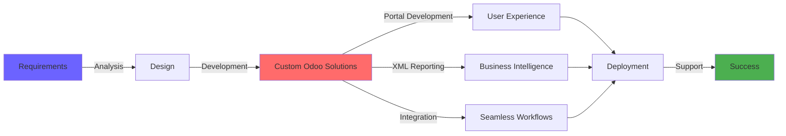

## Hi there 👋

<!--
**M-Ahsan-Ismail/M-Ahsan-Ismail** is a ✨ _special_ ✨ repository because its `README.md` (this file) appears on your GitHub profile.

Here are some ideas to get you started:

- 🔭 I’m currently working on ...
- 🌱 I’m currently learning ...
- 👯 I’m looking to collaborate on ...
- 🤔 I’m looking for help with ...
- 💬 Ask me about ...
- 📫 How to reach me: ...
- 😄 Pronouns: ...
- ⚡ Fun fact: ...
-->

<div align="center">

<!-- Header Banner with Gradient -->


<!-- Animated Typing -->
<a href="https://git.io/typing-svg"></a>

<br/>

<!-- Social Badges with Glow Effect -->
<p align="center">
  <a href="https://ahsan-developer.netlify.app"></a>
  <a href="https://linkedin.com/in/ahsan-ismail-4b4763281/"></a>
  <a href="tel:+923180690159"></a>
</p>

<!-- Decorative Line -->


</div>

## 🎯 About Me

```python
class OdooDeveloper:
    def __init__(self):
        self.name = "Ahsan Ismail"
        self.role = "Odoo Developer"
        self.location = "Pakistan 🇵🇰"
        self.specialization = ["Odoo 16", "Portal Development", "XML Reporting"]
        self.contact = "+92 318 0690159"
        
    def get_expertise(self):
        return {
            "ERP_Framework": ["Odoo 16", "Custom Modules", "Business Logic"],
            "Portal_Development": ["User Interfaces", "Customer Portals", "Access Rights"],
            "Reporting": ["QWeb", "XML Reports", "PDF Generation", "Custom Templates"],
            "Backend": ["Python", "PostgreSQL", "ORM"],
            "Frontend": ["JavaScript", "XML", "QWeb", "CSS"],
            "Integration": ["REST API", "External Systems", "Third-party Services"]
        }
    
    def current_focus(self):
        return [
            "Building scalable Odoo solutions",
            "Enhancing portal user experiences",
            "Creating dynamic XML reports",
            "Optimizing ERP workflows"
        ]
```

<div align="center">

</div>

## 💼 Core Expertise

<div align="center">

### 🚀 Odoo Development Mastery

<table>
<tr>
<td width="50%" valign="top">

#### 🎨 Portal Development
```yaml
Capabilities:
  - Custom portal interfaces
  - User authentication & authorization
  - Dynamic content rendering
  - Responsive design implementation
  - Multi-user access management
  - Real-time data synchronization
```

</td>
<td width="50%" valign="top">

#### 📊 XML Reporting Excellence
```yaml
Expertise:
  - QWeb template design
  - Complex data aggregation
  - PDF report generation
  - Custom layouts & styling
  - Multi-language support
  - Dynamic content injection
```

</td>
</tr>
</table>

</div>

## 🛠️ Technology Arsenal

<div align="center">

### Odoo Ecosystem


### Development Stack


### Integration & Tools


</div>

<div align="center">

</div>

## 🎯 What I Deliver

<div align="center">



</div>

### 🌟 Service Highlights

<table>
<tr>
<td width="33%" align="center">


**Custom Modules**

Tailored Odoo modules designed to fit your unique business processes and requirements

</td>
<td width="33%" align="center">


**Portal Solutions**

Intuitive customer portals with seamless authentication and dynamic content

</td>
<td width="33%" align="center">


**XML Reports**

Professional, pixel-perfect reports with advanced data visualization

</td>
</tr>
</table>

## 📈 Development Philosophy

<div align="center">

| Principle | Approach |
|-----------|----------|
| 🎯 **Clean Code** | Following Odoo best practices and PEP 8 standards |
| 🔒 **Security First** | Implementing robust access rights and data validation |
| ⚡ **Performance** | Optimizing database queries and reducing server load |
| 🎨 **UX Focused** | Creating intuitive interfaces that users love |
| 📱 **Responsive** | Ensuring seamless experience across all devices |
| 🔄 **Maintainable** | Writing documentation and modular, scalable code |

</div>

## 🚀 Featured Projects & Capabilities

```javascript
const projectShowcase = {
    portalDevelopment: {
        features: [
            "Multi-tenant portal architecture",
            "Custom dashboards with real-time data",
            "Document management systems",
            "Interactive forms and workflows",
            "Role-based access control"
        ],
        technologies: ["Odoo 16", "QWeb", "JavaScript", "PostgreSQL"]
    },
    
    xmlReporting: {
        deliverables: [
            "Invoice and quotation templates",
            "Financial reports with charts",
            "Inventory and warehouse reports",
            "Custom business analytics",
            "Multi-currency support"
        ],
        tools: ["QWeb Engine", "ReportLab", "XML", "CSS"]
    },
    
    integration: {
        capabilities: [
            "Third-party API integration",
            "Payment gateway setup",
            "Email and SMS automation",
            "External database synchronization",
            "Webhook implementation"
        ]
    }
}
```

## 💡 Why Work With Me?

<div align="center">

| 🎓 Expertise | 🚀 Delivery | 🤝 Communication |
|-------------|------------|-----------------|
| Deep knowledge of Odoo 16 architecture and best practices | Agile development with regular updates and milestones | Clear documentation and transparent project communication |
| Specialized in portal and XML reporting challenges | Quick turnaround with attention to detail | Available for ongoing support and maintenance |
| Proven track record in ERP implementations | Production-ready, tested solutions | Collaborative approach to problem-solving |

</div>

## 📞 Let's Connect

<div align="center">

### Ready to elevate your Odoo implementation?

<br/>

<a href="https://ahsan-developer.netlify.app">
  
</a>
<a href="https://linkedin.com/in/ahsan-ismail-4b4763281/">
  
</a>
<a href="tel:+923180690159">
  
</a>

<br/><br/>

### 📧 Email: Available on LinkedIn & Portfolio

<br/>

```diff
+ Available for freelance projects and consultations
+ Open to exciting Odoo development opportunities
+ Let's build something amazing together!
```

</div>

## 📊 GitHub Analytics

<div align="center">


</div>

## 🏆 GitHub Trophies

<div align="center">


</div>

---

<div align="center">

### 💫 "Transforming business processes into elegant Odoo solutions"


<!-- Visitor Counter -->


**⭐ If you find my work valuable, consider starring my repositories! ⭐**

</div>
